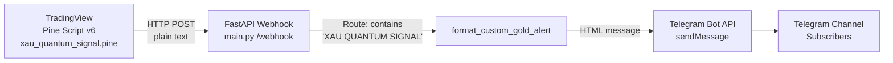
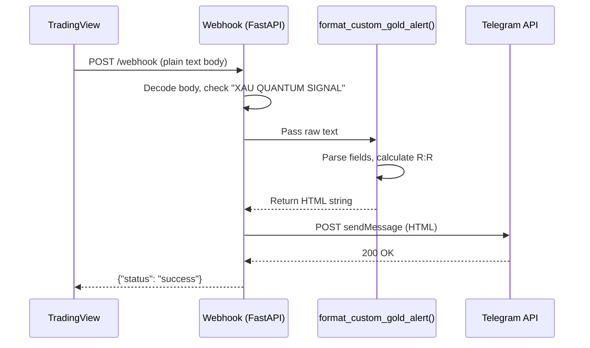

# Design Document: XAU Quantum Signal

## Overview

The XAU Quantum Signal feature adds a Gold (XAUUSD) trading signal pipeline to the existing TradingView-to-Telegram alert system. It introduces:

1. A **Pine Script v6 indicator** (`xau_quantum_signal.pine`) that detects EMA Crossover + MACD confirmation setups on XAUUSD, calculates ATR-based dynamic price levels (Entry, TP1, TP2, SL), and fires structured key-value alerts.
2. A **Python formatter function** (`format_custom_gold_alert`) in `main.py` that parses the alert payload, computes Risk:Reward ratio, and produces an HTML-formatted Telegram message with action-based color logic.
3. **Webhook routing updates** to detect "XAU QUANTUM SIGNAL" alerts before existing handlers.
4. A **health endpoint update** to advertise the new capability.

The design follows the same architectural patterns as the existing US Swing Hunter and US Bandar AI pipelines — Pine Script fires a plain-text alert, the FastAPI webhook receives it, routes to a dedicated formatter, and sends the result to Telegram.

## Architecture



### Signal Flow



### Design Decisions

| Decision | Rationale |
|----------|-----------|
| Plain text alert format (not JSON) | Matches existing US v2 pattern; TradingView alert messages are plain text by default |
| Case-sensitive "XAU QUANTUM SIGNAL" match | Prevents false positives; Pine Script controls exact header text |
| Route check before existing handlers | Ensures new alert type is caught first without modifying existing logic |
| ATR-based dynamic levels | Adapts to Gold's volatility; fixed pip targets would be unreliable |
| Single indicator file (not batched) | Only one ticker (XAUUSD) — no need for multi-ticker batch architecture |

## Components and Interfaces

### Component 1: Pine Script Indicator (`tv_scripts/xau_quantum_signal.pine`)

**Responsibility:** Monitor XAUUSD for EMA crossover + MACD confirmation, calculate ATR-based price levels, fire structured alerts.

**Inputs (configurable):**
| Parameter | Type | Default | Range |
|-----------|------|---------|-------|
| `emaFastLen` | int | 9 | 2–200 |
| `emaSlowLen` | int | 21 | 2–200 |
| `macdFast` | int | 12 | — |
| `macdSlow` | int | 26 | — |
| `macdSignal` | int | 9 | — |
| `atrPeriod` | int | 14 | 1–200 |
| `atrMultTP1` | float | 1.0 | 0.1–10.0 |
| `atrMultTP2` | float | 2.0 | 0.1–10.0 |
| `atrMultSL` | float | 1.5 | 0.1–10.0 |

**Output:** Alert payload (plain text, one field per line):
```
👑 XAU QUANTUM SIGNAL
Ticker: XAUUSD
Action: BUY
Entry: 2345.67
TP1: 2360.12
TP2: 2374.57
SL: 2324.00
Context: BUY — EMA9 crossed above EMA21, MACD histogram positive
```

**Key Logic:**
- EMA crossover detection using `ta.crossover()` / `ta.crossunder()`
- MACD histogram via `ta.macd()` — confirm histogram > 0 for BUY, < 0 for SELL
- ATR via `ta.atr(atrPeriod)`
- Signal only on `barstate.isconfirmed`
- Alert frequency: `alert.freq_once_per_bar_close`
- Guard: suppress if `bar_index < atrPeriod` (insufficient bars)

### Component 2: Alert Formatter (`format_custom_gold_alert` in `main.py`)

**Responsibility:** Parse raw alert text, extract fields, compute Risk:Reward, produce HTML Telegram message.

**Interface:**
```python
def format_custom_gold_alert(raw: str) -> str:
    """
    Parse XAU Quantum Signal alert text and return HTML-formatted Telegram message.
    
    Args:
        raw: Plain text alert body from TradingView
        
    Returns:
        HTML string ready for Telegram sendMessage with parse_mode="HTML"
    """
```

**Parsing Strategy:**
- Split on newlines, iterate lines
- For each known prefix (`Ticker:`, `Action:`, `Entry:`, `TP1:`, `TP2:`, `SL:`, `Context:`), extract value after colon, strip whitespace
- Price fields: attempt `float()` conversion; fallback to `0.00`
- Text fields: fallback to `"???"`
- Action validation: must be exactly `"BUY"` or `"SELL"`; otherwise `"???"`

**Risk:Reward Calculation:**
- BUY: `R:R = (TP1 - Entry) / (Entry - SL)`
- SELL: `R:R = (Entry - TP1) / (SL - Entry)`
- Guard: if denominator == 0, display `"N/A"`
- Format: 1 decimal place (e.g., `"0.7"`)

### Component 3: Webhook Router Update (`handle_webhook` in `main.py`)

**Change:** Insert `"XAU QUANTUM SIGNAL" in body_str` check **before** the existing `"US SWING HUNTER"` check in the plain-text routing block.

```python
# New check — inserted first
if "XAU QUANTUM SIGNAL" in body_str:
    message_text = format_custom_gold_alert(body_str)
elif "HEARTBEAT TEST" in body_str:
    ...
elif "US SWING HUNTER" in body_str:
    ...
```

**Note:** The requirement specifies case-sensitive match. Using Python's `in` operator on the decoded string satisfies this.

### Component 4: Health Endpoint Update

**Change:** Add `"XAU Quantum Signal (plain text)"` to the `supported_alerts` list.

## Data Models

### Alert Payload Schema (Pine Script → Webhook)

```
Line 1: "👑 XAU QUANTUM SIGNAL"          (header, fixed)
Line 2: "Ticker: XAUUSD"                  (string, fixed for this indicator)
Line 3: "Action: {BUY|SELL}"              (enum string)
Line 4: "Entry: {float:.2f}"             (price, 2 decimal places)
Line 5: "TP1: {float:.2f}"               (price, 2 decimal places)
Line 6: "TP2: {float:.2f}"               (price, 2 decimal places)
Line 7: "SL: {float:.2f}"                (price, 2 decimal places)
Line 8: "Context: {string, max 120 chars}" (human-readable summary)
```

### Parsed Data (internal to formatter)

| Field | Type | Default | Constraints |
|-------|------|---------|-------------|
| `ticker` | str | `"???"` | max 20 chars |
| `action` | str | `"???"` | must be "BUY" or "SELL" for valid formatting |
| `entry` | float | `0.00` | ≥ 0 |
| `tp1` | float | `0.00` | ≥ 0 |
| `tp2` | float | `0.00` | ≥ 0 |
| `sl` | float | `0.00` | ≥ 0 |
| `context` | str | `"???"` | max 200 chars |

### Telegram Message Structure

```
{emoji} XAU QUANTUM SIGNAL {emoji}
━━━━━━━━━━━━━━━━━━
🏷 Ticker: XAUUSD
⚡ Action: BUY
🎯 Entry: 2345.67
✅ TP1: 2360.12
✅ TP2: 2374.57
🛑 SL: 2324.00
━━━━━━━━━━━━━━━━━━
📊 Context: BUY — EMA9 crossed above EMA21, MACD histogram positive
⚖️ Risk:Reward: 0.7
━━━━━━━━━━━━━━━━━━
#XAU_QUANTUM #XAUUSD
```

## Correctness Properties

*A property is a characteristic or behavior that should hold true across all valid executions of a system — essentially, a formal statement about what the system should do. Properties serve as the bridge between human-readable specifications and machine-verifiable correctness guarantees.*

### Property 1: Parsing round-trip preserves field values

*For any* valid alert payload containing Ticker, Action, Entry, TP1, TP2, SL, and Context fields with valid values, the formatted Telegram message SHALL contain each field's value (prices to 2 decimal places, text fields as-is).

**Validates: Requirements 5.1, 5.2, 5.3, 5.4, 5.5, 5.6, 5.7**

### Property 2: Graceful degradation for malformed payloads

*For any* alert payload where one or more fields are missing, empty, or contain non-numeric values in price positions, the formatter SHALL produce a valid output string (non-empty, valid HTML) using default placeholders ("???" for text fields, "0.00" for price fields) without raising exceptions.

**Validates: Requirements 5.8, 5.9, 5.10**

### Property 3: Action determines directional emoji

*For any* alert payload with Action "BUY", the formatted output SHALL contain the 🟢 emoji and NOT contain 🔴 in the header. *For any* alert payload with Action "SELL", the formatted output SHALL contain the 🔴 emoji and NOT contain 🟢 in the header.

**Validates: Requirements 6.1, 6.2**

### Property 4: Risk:Reward calculation correctness

*For any* alert payload with valid numeric Entry, TP1, and SL where the denominator is non-zero, the Risk:Reward value displayed in the output SHALL equal `(TP1 - Entry) / (Entry - SL)` for BUY signals and `(Entry - TP1) / (SL - Entry)` for SELL signals, formatted to 1 decimal place. When the denominator is zero, the output SHALL display "N/A".

**Validates: Requirements 6.5, 6.6**

### Property 5: Message structural integrity

*For any* valid alert payload, the formatted output SHALL contain: (a) bold HTML tags (`<b>`) for field labels, (b) all price values formatted to exactly 2 decimal places, (c) the Context field value, (d) separator lines (━━━━━━━━━━━━━━━━━━) dividing sections, (e) hashtags #XAU_QUANTUM and #XAUUSD, and (f) sections in the order: header, separator, price levels, separator, context+R:R, separator, hashtags.

**Validates: Requirements 6.3, 6.4, 6.7, 6.8, 6.9, 6.10**

## Error Handling

### Pine Script (Indicator)

| Scenario | Handling |
|----------|----------|
| Insufficient bars for ATR calculation | Suppress signal generation (`bar_index < atrPeriod` guard) |
| MACD histogram exactly 0 | Do not generate signal |
| Fast EMA ≥ Slow EMA (invalid config) | Pine Script input validation prevents this via `minval`/`maxval` constraints |

### Python Formatter (`format_custom_gold_alert`)

| Scenario | Handling |
|----------|----------|
| Missing field line in payload | Use default placeholder (`"???"` or `"0.00"`) |
| Non-numeric price value | Treat as missing, use `"0.00"` |
| Invalid Action (not BUY/SELL) | Display `"???"`, use neutral formatting (no directional emoji) |
| R:R denominator is zero | Display `"N/A"` instead of numeric value |
| Empty payload | All fields default, produce valid (if unhelpful) message |
| Extremely long field values | Ticker capped at 20 chars, Context at 200 chars via slicing |

### Webhook Router

| Scenario | Handling |
|----------|----------|
| Payload contains "XAU QUANTUM SIGNAL" but malformed fields | Formatter handles gracefully with defaults |
| Telegram API failure | Existing `send_to_telegram` error handling (log + continue) |
| Non-UTF8 body | Existing `decode("utf-8", errors="replace")` handles this |

## Testing Strategy

### Unit Tests (Example-Based)

Focus on specific scenarios and integration points:

1. **Routing tests** — Verify "XAU QUANTUM SIGNAL" routes to `format_custom_gold_alert()`, verify priority over "US SWING HUNTER"
2. **Case sensitivity** — Verify lowercase "xau quantum signal" does NOT trigger the handler
3. **Health endpoint** — Verify new entry in `supported_alerts` list, verify existing entries preserved
4. **Hashtag presence** — Verify `#XAU_QUANTUM` and `#XAUUSD` in output
5. **Separator lines** — Verify `━━━━━━━━━━━━━━━━━━` dividers present

### Property-Based Tests (Hypothesis)

Use the `hypothesis` library for Python. Each property test runs minimum 100 iterations.

| Property | Test Strategy | Generator |
|----------|---------------|-----------|
| Property 1: Parsing round-trip | Generate random valid payloads (random prices 1000–5000, random tickers, BUY/SELL), verify all values appear in output | `st.floats(min_value=1000, max_value=5000)`, `st.sampled_from(["BUY", "SELL"])`, `st.text(min_size=1, max_size=20)` |
| Property 2: Graceful degradation | Generate payloads with random subsets of fields missing or containing garbage strings in price positions | `st.lists(st.sampled_from(fields))` for missing fields, `st.text()` for garbage prices |
| Property 3: Action emoji | Generate valid payloads with BUY or SELL, verify correct emoji | `st.sampled_from(["BUY", "SELL"])` |
| Property 4: R:R calculation | Generate random Entry/TP1/SL triples, compute expected R:R, verify output matches | `st.floats(min_value=100, max_value=5000, allow_nan=False)` |
| Property 5: Structural integrity | Generate random valid payloads, verify all structural elements present in correct order | Composite strategy combining price and text generators |

**Configuration:**
- Library: `hypothesis` (Python)
- Minimum iterations: 100 per property (`@settings(max_examples=100)`)
- Each test tagged with: `# Feature: xau-quantum-signal, Property {N}: {title}`

### Integration Tests

1. **End-to-end webhook test** — POST a valid XAU alert payload to `/webhook`, mock Telegram API, verify formatted message sent
2. **Pine Script manual verification** — Apply indicator to XAUUSD chart, verify alert payload format matches specification

### What Is NOT Tested with PBT

- Pine Script indicator logic (runs in TradingView, not testable in Python)
- Telegram API delivery (external service)
- Webhook HTTP handling (FastAPI framework responsibility)
- Docker deployment configuration

